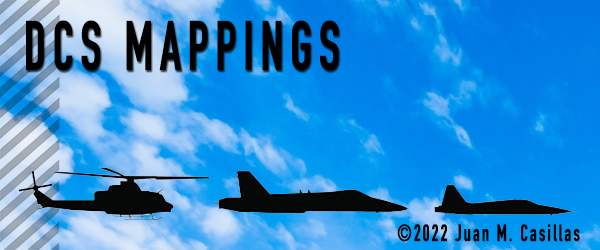
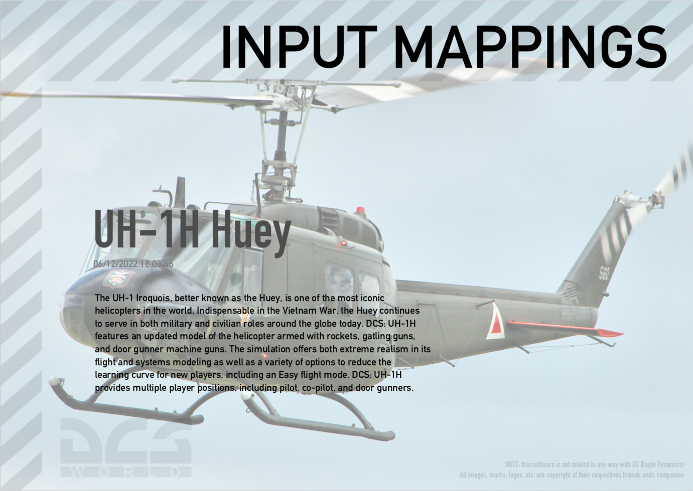
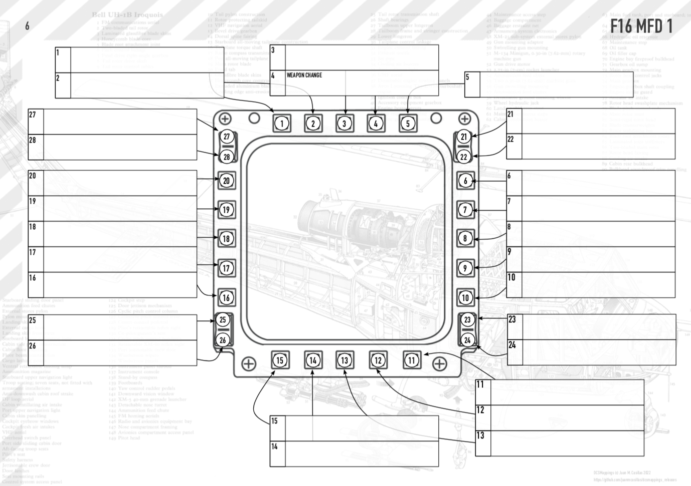
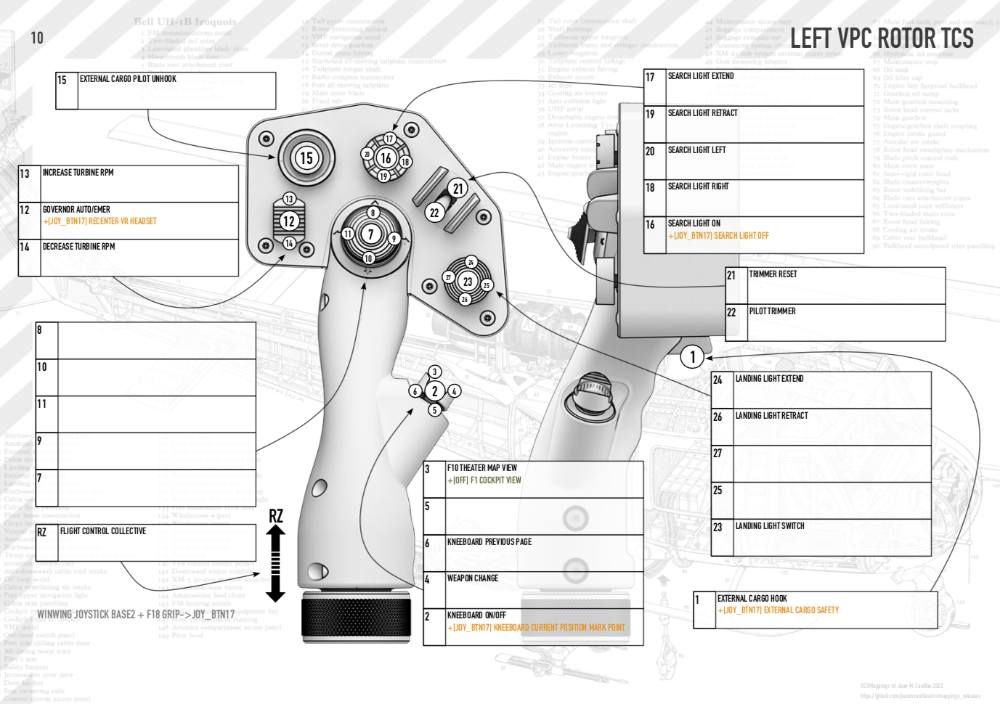
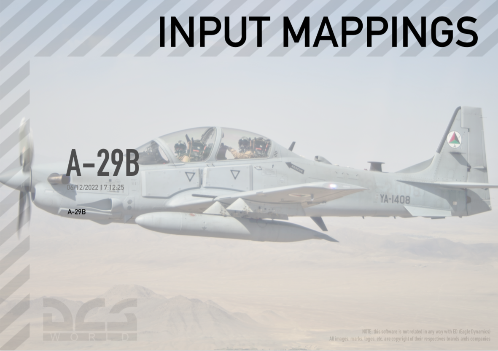
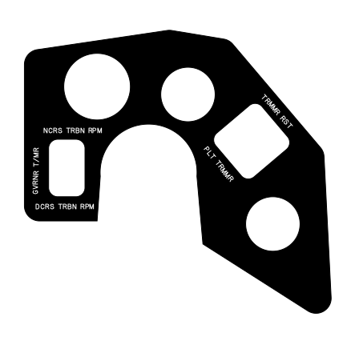

# DCSMapping Releases

## Changelog (19/12/2022)

* Fully supported `A4_Portrait` template.
* Fully supported `Kneeboard` template. This allows you to add the DCSMappings to the Kneeboard of the plane in DCS. Fixed the texture size, the font resolution, and improve the legibility. Tested also with OpenKneeboard and works fine.
* Added support for abbreviation in commands, using (enchant)[https://pyenchant.github.io/pyenchant/] and (python-abbreviate)[https://github.com/ppannuto/python-abbreviate]
* Added self-signed support, to try to avoid the SmartScreen warning.


## Changelog (16/12/2022)

* Added support for `A4_Portrait` template, and `Kneeboard` support generation.

## Changelog (15/12/2022)

* Added support for keyboard buttons in BLButtons template device. See [BLButtons](https://github.com/juanmcasillas/BLButtons ) and [BLCombo](https://github.com/juanmcasillas/ESP32-BLE-Combo) repos for more info.

## Changelog (08/12/2022)

* Added a new button to collect info. This button collect the input configuration so I can debug the problem.
* Added a new button to store paths. If the file exists (config/paths.json) its read.
* Added a new release with it.

## Changelog (07/12/2022)

* Added a splash screen
* Added icons and images as resources (fixed the icon not found error)
* Changed the logging system so now we can see what it's doing the system
* Fixed some usability glitches

**NOTE**: Some antivirus detect the installer as `(Wacatac.B!ml)` this is due the installer is not signed.
**NOTE**: `DCSMappings` doesn't need special Administrator privileges to run.
**NOTE**: `DCSMappings` has been tested with the Steam version of DCS (version 2.8)

<p align="center">

</p>

## What it does ?

Generate mappings based on templates for DCS input (joystick mappings), also aimple script to document DCS keyBindings for my setup.

<p align="center">

</p>

<p align="center">

</p>

<p align="center">

</p>

<p align="center">

</p>


I'm working on generate overlays also, so I added **themes** and per theme configuration styles!

<p align="center">

</p>

## How to use

Currently, the project is build arround a command line program and some modules. The GUI is very, very basic, but it 
should work to test all the process. Just install the application with the installer, install the fonts, and then
point to the `DCS` installation directory and `Saved Games` directory. That's all.

## templates

The "military" font used is `MS 33558` truetype font. See `/resources`.  You should install it in order to have the thing working. The problem is that this font doesn't have any glyphs, so I switch to use DIN standard font (used by Airbus)

All the templates are done on (inkscape)[https://inkscape.org]. I use it because it allows me to change the element's `id` attribute in the `svg` file, so I can "tune" the `svg` file to add the information, keeping the templates easy. How to do the template:

* Start a black document, in `A4` size (for example)
* Place the image in the bottom layer
* Add a second layer, build the template (lines, button info, etc).
* Add a third layer at top and add the `rects`. Draw texts where the text is going to be.
* change the `id` field of the `text` either to `JOY_BTNnn` or `JOY_yy` where `nn` is a number (e.g. 01, 1, 10) and `nn` is an axis (e.g. RX, RY). See below for supported input syntax.
* export the template to the same name of the device (e.g. `templates/virpil/LEFT VPC Rotor TCS.svg`)
* Done, the script loads the XML and add the `text` fields in the right places.

## Special boxes:

There are some "special" boxes in order to show some info

* Add a box for SHIP (id='SHIP') to store the name of the ship
* Add a box for DATE (id='DATE') to store the creation date
* Add a box for TEMPLATE (id='TEMPLATE') to store the template name
* Add a box for MODIFIERS (id='MODIFIERS') to store the modifiers info

## Themeable Images

If you use images, you can use placeholders using the images on `templates/images/SHIP_NAME/*files*` then the system
will change the image with the right ship, E.g. `templates/images/SHIP_NAME/1.jpg` (e.g. generic plane image) will be
replaced with the `UH-1H` images if run with `-m UH1-h output` parameter (use the Huey plane config). For now, only
a little images are available.
## Styles

Styles are stored in `styles.json` file.  Each theme is a directory in `templates` with a `styles.json` file inside. Special style is `globals`:

```
    "globals": {
        "short_commands": false
    },
```

if `short_commands` is `true`the vowels are removed. For now, we are trying to generate device overlays (in progress). Also support `fill` entry to change the fill color (the text color).

## Layers

You should create four layers (the name is irrelevant, just for organization). The order is important, so we 
write on the top most layer (`Data`).

1. `Data`. Stores the template boxes (ship, date, modifiers, template) and label boxes (for commands).
2. `LabelBoxes`. Stores the draws for the label boxes (rect, button number, arrows).
3. `Buttons`. Stores the device buttons (rounded circles with the number, on the phisical buttons).
4. `BgImage`. The background image.

Add **EACH** element in `Data` inside a **group**. To do that, simply get the rect and group it (Alt-G) so if 
you plan to transform the text (e.g Rotate the rectangle, and so on, if we want to generate OVERLAYS for the 
physical device) doing the thing in this way allows the system to place the text and rotate it right. Note that
the transformation **must** be applied to the group, not the rect. Also, if you want precise placement, use the
topleft corner as index See below for overlay tips.

<p align="center">

</p>


## Inkscape things

[Text inside rectangles](https://graphicdesign.stackexchange.com/questions/136385/text-at-the-center-of-a-rectangle-in-inkscape)
[Numpy bug fix to import dxf](https://gitlab.com/inkscape/inkscape/-/issues/3551)

````
# Move away numpy version packaged with Inkscape 1.2
mkdir -p /Applications/Inkscape.app/Contents/Resources/lib/python3.10/site-packages.original
mv /Applications/Inkscape.app/Contents/Resources/lib/python3.10/site-packages/numpy* /Applications/Inkscape.app/Contents/Resources/lib/python3.10/site-packages.original

# Confirm the removal
/Applications/Inkscape.app/Contents/Frameworks/Python.framework/Versions/3.10/bin/python3 -m pip cache remove numpy

# Install a BLAS version without accelerators (if I understand correctly), which will later be used to compile numpy
brew install openblas

# Set the path to the just installed OpenBLAS in the current environment
OPENBLAS="$(brew --prefix openblas)"

# Now install numpy using OpenBLAS
/Applications/Inkscape.app/Contents/Frameworks/Python.framework/Versions/3.10/bin/python3 -m pip install numpy

# Check that and where the new version of numpy was installed
/Applications/Inkscape.app/Contents/Frameworks/Python.framework/Versions/3.10/bin/python3 -m pip list -v

# Move the just installed numpy version into Inkscape's Python library
mv /Applications/Inkscape.app/Contents/Frameworks/Python.framework/Versions/3.10/lib/python3.10/site-packages/numpy* /Applications/Inkscape.app/Contents/Resources/lib/python3.10/site-packages

# Now restart Inkscape 1.2 and voilá!
````

## font size equivalents

* 2.82222px 8px
* 3.52778px 10px
* 3.88056px 11px
* 4.23333px 12px 


# Overlay Tips

* To get a `.dxf`from inventor, simply extrude de sketch, select face, export as `.dxf`
* Import the `.dxf` file into **inkscape** and deselect "scale automatically")
* Rotate the shape as desired, and when finished, select all the shapes and compute `Path->Exclusion` to get the holes
* If you plan to use **rotated** labels:
  1. Do a **small** rectangle, 1hx2w(mm) for example.
  2. Group it with ^G.
  3. Apply the rotation (NO SCALE) to the GROUP (if you scale it, you scale also the text inserted later).
  4. Change the id to something supported (e.g. BUTTON_3).
  5. In styles of the overlay for the `layer` entry put `margin-top` and `margin-left`to 0, to enable precise placement of the strings.
* No use spaces in the images included on inkscape, or `%20` will appear in the path, breaking everything.
* Use the desired font (e.g. condensed) instead of font style, or the pdf will be generated with the wrong font.

## Supported buttons

* **AXIS** JOY_X, JOY_RX, JOY_Y, JOY_RY, JOY_Z, JOY_RZ, JOY_SLIDER1, JOY_SLIDER2, JOY_DIAL1, JOY_DIAL2 
* **BUTTONS** JOY_BTN*nn* where **nn** goes from `0` to `127` 
* **POVS** JOY_BTN_POV*n*_[U,D,L,R,UR,UL,DR,DR] 
* **MOUSE** MOUSE_X, MOUSE_Y, MOUSE_Z, MOUSE_BTN1, MOUSE_BTN2, MOUSE_BTN3 (template MOUSE_*axis_or_button_name*)
* **KEYBOARD** LCtrl,LAlt,RShift,LShift,RCtrl,RAlt,F1,F2,A,B,C,NumEnter,\\,NumLock,SysRQ (Template KEY_*key*)
